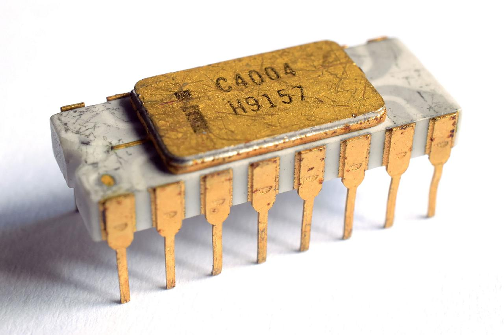
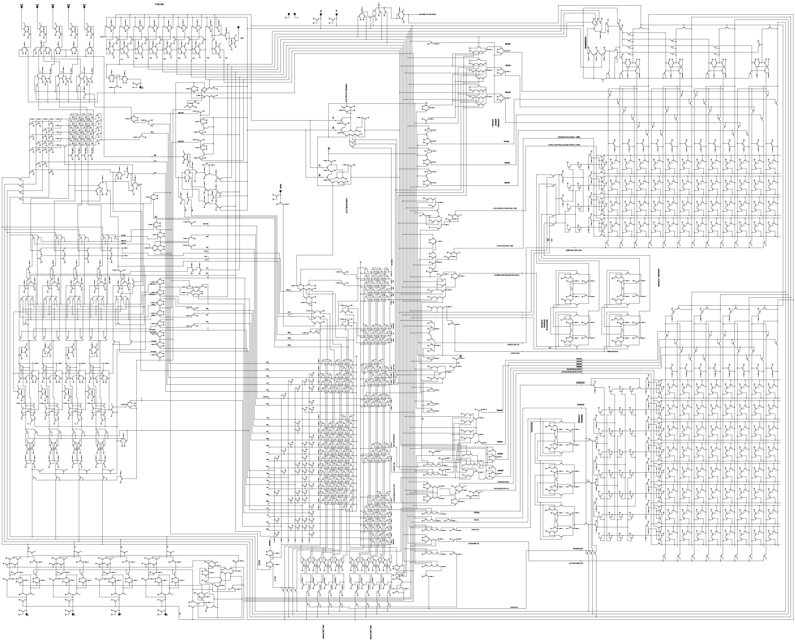
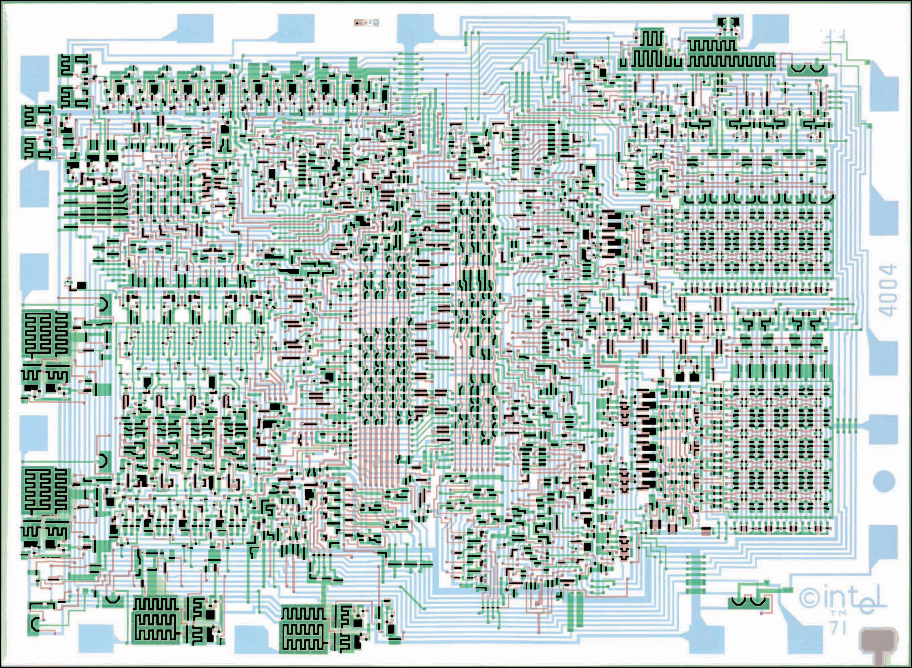
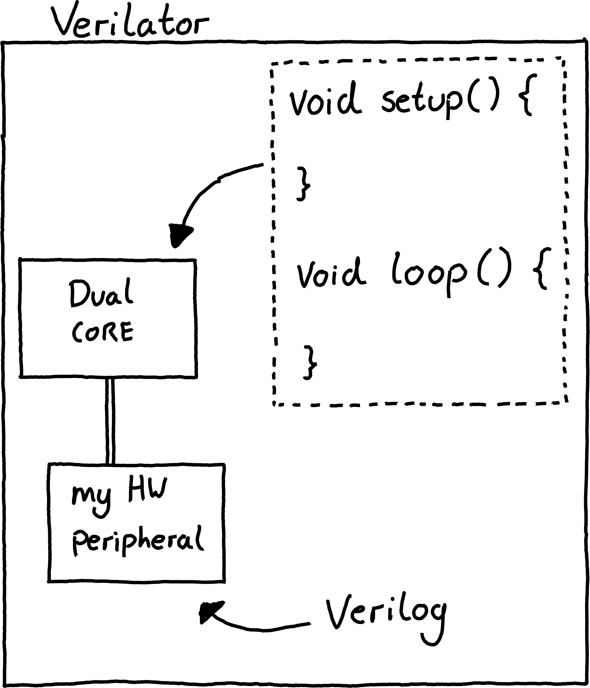

# EmSys: Hardware Description Languages (HDLs)

Up until this point we have been learning about embedded systems from a SW perspective. However, let's start looking from a hardware perspective and actually describe some hardware.

## Early microprocessor design

  

In 1971, the first commercial microprocessor, the Intel 4004, was developed. It was a revolutionary technology that placed a full 4-bit general purpose CPU into a small silicon chip, consisting of around 2300 transistors. Prior to the 4004 CPUs would have consisted of many chips, would have been much slower, and much more power hungry.  

  

The 2300 transistors that made up the Intel 4004 were all designed using a schematic diagram. Essentially, a large circuit was hand drawn showing how each individual transistor was connected to the other transistors. 

  

From the schematic something called a mask was constructed. A mask shows the layout of the transistors on the silicon wafer and is used by the foundry during photolithography to construct the gates on the silicon wafer.

Doing such things manually by hand worked for a while, however, quite quickly the available transistor counts rapidly increased and the scalability of such approaches became an issue. Nowadays we have moved from microprocessors like the Intel 4004 consisting of 2300 transistors, to __Apples M1 Max that contains 57 Billion__.  

## Electronic design automation
Shortly after the release of the Intel 4004, in the mid 1970's, engineers started to work on using computers to aid in the layout and design of microprocessor circuits. They developed tools, such as place and route tools, that could be given a more abstract description of the circuit and generate schematics for how components should be connected together. However, it wasn't until the mid 1980's that this idea of using high-level languages to develop complex digitial circuits really started to take off with the creation of hardware modelling languages like Verilog and VHDL. 

Initially Verilog and VHDL, known as hardware description languages (HDLs), were high-level ways for engineers and chip designers to simulate and test their designs. They would describe the logical functionality of their circuits at a high-level, test it using simulations to ensure correct operation, and then went through the labor-intensive manual process of hand designing the schematic for the circuit. However, with dramatically increasing available transistors there was a growing call to automate the process of hand designing circuit schematics. 

An idea of logic synthesis, where HDLs were compiled down to gates and transistors, started to emerge in academia and industry. This move to logic synthesis thrust HDLs from being a small part of the silicon design process to being right at the forefront. While logic synthesis could not produce circuits that were are optimal or power efficient as hand drawn schematics, the productivity boost that they offered meant that they were quickly adopted. Nowadays, it is the primary way that digital circuits are described. 

## Let's describe some hardware

In this course we are exploring embedded systems. Crucial to embedded systems are constraints like:
* Timing and latency, how quickly can your system respond to events.
* Power, especially for battery operated devices.
* Performance.

Hardware plays a crucial role here, if we want to perform computation or control peripherals more efficiently then we need custom hardware rather than general purpose CPUs controlling everything. We've seen this with our ESP32 SoC, it contains custom hardware peripherals for common IoT operations, such as encryption, and communication protocols that have tight timing constraints.

Up until now we have looked at how we can write software, in C, to configure and interact with the memory-mapped hardware components. However, I want us also to explore the other side of this interface and develop some hardware and simulate it. For the next couple of lectures we will explore this, and in the lab sessions, will describe hardware in Verilog (a dominant hardware description language).  

  

We will use an open-source hardware simulator, called [Verilator](https://www.veripool.org/verilator/). With Verilator we will be able to simulate some hardware that we have described in Verilog along with arduino-like code that is running on a simulated microprocessor. By the end of the labs we will be able to construct hardware for something known as a pulse-width modulation (PWM) module, simulate it, and compare it to the PWM module on our TinyPico devices. 

I have tried to break down each of the concepts of verilog that I am teaching into short 5-10 minute videos. In the rest of this document you will find the links to those videos.

1. Overview of a what a HDLs purpose is.
	* How to develop hardware?
	* Schematic level
	* Abstraction level increase: Textually describe circuits
	* VLSI design flow 
	* Hardware/Software boundary : how do the two worlds meet
	* Verilator Simulator : cycle accurate simulation -> doesn't simulate the physics, will simulate the timing and logical connections. Gate-level cycle accurate simulations.
	* Plan in this course: simulate both the software running here, and the hardware here.
	* What the next labs will look like.
2. Recap of logic gates.
	* What is an AND gate?
	* What is an OR gate?
	* What is a NOT gate?
	* Chaining gates together, making a NAND gate.
	* Creating modules or blocks
3. Verilog modules : Syntax
	* Inputs 
	* Outputs
4. simple_in_n_out
	* How to define a module.
	* How to define some gates.
5. Intermediate signals
	* How to define wires (or signals) to connect things together.
6. Bus signals
	* How to define arrays of wires (usually to represent numbers).
7. Procedural always_blocks
	* How to specify the logic in a more code-like behavioural fashion.

8. Recap!
