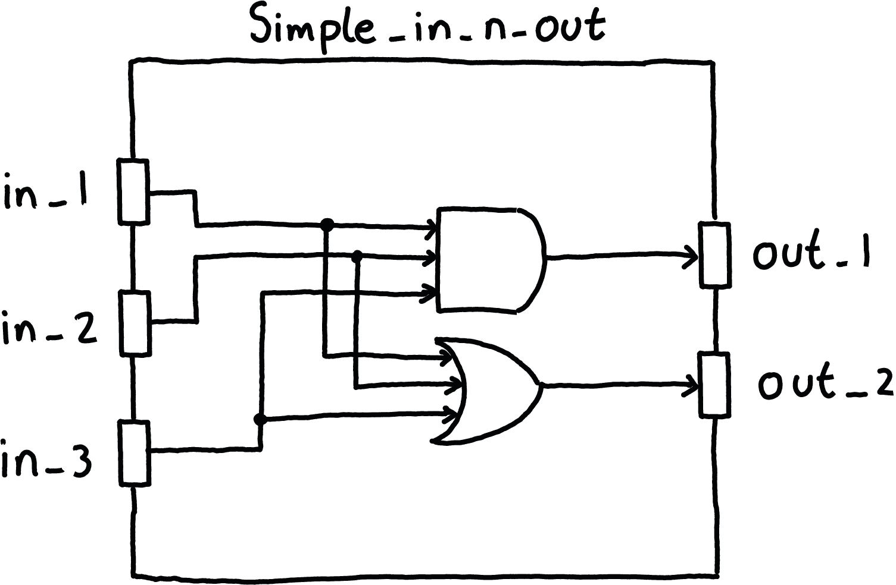

# EmSys: Hardware Description Languages (HDLs)

Up until this point, we have been learning about embedded systems from a SW perspective. However, let's start looking from a hardware perspective and describe some hardware as if we were chip designers or hardware engineers.

The lesson will consist of a few short videos describing different parts of hardware description with Verilog, below is some quick links to those videos:
* [1: simple in-n-out](https://www.youtube.com/watch?v=fnoMnokP9mI)
* [2: intermediate signals](https://www.youtube.com/watch?v=ljmm6S6k2Aw)
* [3: bus signals and multiplexers](https://www.youtube.com/watch?v=Jb-gnzetZts)
* [4(a): procedural blocks](https://www.youtube.com/watch?v=xdUcyrSBPWk)
* [4(b): literal values & concatenation](https://www.youtube.com/watch?v=3n8KvPvERuo)
* [4(c): larger multiplexer](https://www.youtube.com/watch?v=KYga2d_1dnA)

## Early microprocessor design

<p align="center">
  
</p>
In 1971, the first commercial microprocessor, the Intel 4004, was developed. It was a revolutionary technology that placed a full 4-bit general-purpose CPU into a small silicon chip, consisting of around 2300 transistors. Before the 4004, such systems would have consisted of many chips, would have been much slower, and much more power-hungry.  

<p align="center">
  
</p>
The 2300 transistors that made up the Intel 4004 were all designed using a schematic diagram. Essentially, a large circuit was hand-drawn showing how each individual transistor was connected to the other transistors. 

<p align="center">
  
</p>
From the schematic something called a mask was constructed. A mask shows the layout of the transistors on the silicon wafer. They are used by the foundry during photolithography to construct the gates on the silicon wafer.

Doing such things by hand was feasible for a while. However, quite quickly the available transistor counts rapidly increased and the scalability of such approaches became an issue. Nowadays, we have moved from microprocessors like the Intel 4004 consisting of 2300 transistors to __Apples M1 Max that contains 57 Billion__.

## Electronic design automation
Shortly after the release of the Intel 4004, in the mid-1970s, engineers started to work on using computers to aid in the layout and design of microprocessor circuits. They developed tools, such as place and route tools, that could be given a more abstract description of the circuit and generate schematics for how components should be connected. However, it wasn't until the mid-1980's that this idea of using high-level languages to develop complex digital circuits started to take off with the creation of hardware modelling languages like Verilog and VHDL.

Initially, Verilog and VHDL, known as hardware description languages (HDLs), were high-level ways for engineers and chip designers to simulate and test their designs. They would describe the logical functionality of their circuits at a high level, test it using simulations to ensure correct operation, and would then go through the labour-intensive manual process of hand designing the schematic for the circuit. However, with dramatically increasing available transistors there was a growing call to automate the process of hand designing circuit schematics.

Logic synthesis, where HDLs were compiled down to gates and transistors, became a popular idea emerging in academia and industry. This move to logic synthesis thrust HDLs from being a small part of the silicon design process to being right at the forefront. While logic synthesis could not produce as optimal or power-efficient circuits as hand-drawn schematics, the productivity boost that they offered meant that the technique was quickly adopted. Nowadays, it is the primary way that digital circuits are described and designed.

## Let's describe some hardware

In this course we are exploring embedded systems. Crucial to embedded systems are constraints like:
* Timing and latency, how quickly can your system respond to events.
* Power, especially for battery operated devices.
* Performance.

Hardware plays a crucial role here, if we want to perform computation or control peripherals more efficiently then we need custom hardware rather than general-purpose CPUs controlling everything. We've seen this with our ESP32 SoC, it contains custom hardware peripherals for common IoT operations, such as encryption, and communication protocols that have tight timing constraints.

Up until now, we have looked at how we can write software, in C, to configure and interact with the memory-mapped hardware components. However, I want us also to explore the other side of this interface and develop some hardware and simulate it. For the next couple of lectures we will explore this, and in the lab sessions, will describe hardware in Verilog (a mainstream hardware description language).

<p align="center">
  
</p>
We will use an open-source hardware simulator, called [Verilator](https://www.veripool.org/verilator/). With Verilator, we will be able to simulate some hardware that we have described in Verilog along with Arduino-like code that can interact with it. By the end of the labs, we will construct hardware for something known as pulse-width modulation (PWM) module, simulate it, and compare it to the PWM module on our TinyPico devices.

I have tried to break down each of the concepts of Verilog that I am teaching into short 5-10 minute videos. In the rest of this document, you will find the links to those videos, and code example used in the videos.

## Recap of logic gates

To start with we will only consider simpler digital circuits so that we can get used to the Verilog syntax and paradigms. Let's briefly recap some basic logic gates. 

<p align="center">
  
</p>

Above is an __AND__ gate. This gate has two inputs ``A`` and ``B`` and an output ``Q`` that is only high when the two inputs are both high.

<p align="center">
  
</p>

Above is an __OR__ gate. This gate has two inputs ``A`` and ``B`` and an output ``Q`` that is high when either of the two inputs are high.

<p align="center">
  
</p>

Above is a __NOT__ gate. This gate has one inputs ``A`` and an output ``Q`` that is the opposite of whatever the input is.

<p align="center">
  
</p>

We can also of course chain these gates together, above we have an __AND__ gate that is followed by an __NOT__ gate. This is called a __NAND__ gate. 

<p align="center">
  
</p>

However, sometimes we have a more convenient notation for showing this, where if we are inverting an input or an output we put a ``o`` next to it. For example, above represents a __NAND__ gate, the same as chaining a __NOT__ gate to the output of a __AND__ gate.

<p align="center">
  
</p>

We can also have more than two inputs for our gates, above shown a __3-input AND__ gate, where the output ``Q`` is only high when all three inputs are high.

<p align="center">
  
</p>

To aid design, we also often package gates up into modules, where we define some input ports and output ports and the internal logic is hidden. These modules can then be instantiated multiple times, making hierarchical design of circuits a bit cleaner.

## Simple in-n-out circuit

<p align="center">
  
</p>

Now that we have recapped some of the basics of logic gates and modular digital design, let's put them to use designing the simple circuit above in Verilog. Once we've finished our design we can then simulate it and examine the waveform of the signals in a waveform viewer. __Please watch the following video that describes how we can do this with Verilog and Verilator.__

<p align="center">
        <a href="http://www.youtube.com/watch?feature=player_embedded&v=fnoMnokP9mI
        " target="_blank"></a>
</p>

To build and run this example on the Linux lab machines (assuming you are in the root of this repository):
```
	cd lessons/1-simple_in_n_out
	make
```

Once the simulation completes you can then open ``gtkwave`` to look at the waveform.

```
	gtkwave wavedump.vcd
```

## Intermediate signals

<p align="center">
  
</p>

Sometimes we need internal signals to connect up our circuit, not just input and output ports. __Please watch the following video that describes how we can define such signals with Verilog.__

<p align="center">
        <a href="http://www.youtube.com/watch?feature=player_embedded&v=ljmm6S6k2Aw
        " target="_blank"></a>
</p>

To build and run this example on the Linux lab machines (assuming you are in the root of this repository):
```
	cd lessons/2-intermediate_signal
	make
```

Once the simulation completes you can then open ``gtkwave`` to look at the waveform.

```
	gtkwave wavedump.vcd
```

## Bus Signals and Multiplexers

<p align="center">
  
</p>

Sometimes we want more than one wire, and we want to be able to switch between different sets of outputs. __The following video explains how we can describe multibit wires in Verilog and construct a simple multiplexer.__

<p align="center">
        <a href="http://www.youtube.com/watch?feature=player_embedded&v=Jb-gnzetZts
        " target="_blank"></a>
</p>

To build and run this example on the Linux lab machines (assuming you are in the root of this repository):
```
	cd lessons/3-busses_and_muxes
	make
```

Once the simulation completes you can then open ``gtkwave`` to look at the waveform.

```
	gtkwave wavedump.vcd
```

## Procedural Always Blocks

<p align="center">
  
</p>

In the previous video tutorials we described the structure of our circuits, with wires and operations. However, for more complicated blocks of hardware this can get quite cumbersome. Luckily, Verilog has the ability for us to describe a block of hardwares behaviour, rather than structure, using something called, procedural blocks. Within these blocks we can describe some behaviour of some logic much closer to how we would write code that we would execute on a processor. Each line of code can be conceptually thought to execute sequentially within the procedural block. __In this section there are three videos that aim to clarify this idea a bit better. They will also show an example where we construct a larger multiplexer circuit.

### Video 1 : Procedural blocks

_Discusses how to use an ```always_comb``` block.__

<p align="center">
        <a href="http://www.youtube.com/watch?feature=player_embedded&v=xdUcyrSBPWk
        " target="_blank"></a>
</p>

### Video 2: Literal values

_Discusses how to declare literal values in Verilog including bitwidth._
<p align="center">
        <a href="http://www.youtube.com/watch?feature=player_embedded&v=3n8KvPvERuo
        " target="_blank"></a>
</p>

### Video 3: Describing a larger Multiplexer

_Puts the pieces of the last two videos together to make a larger multiplexer._
<p align="center">
        <a href="http://www.youtube.com/watch?feature=player_embedded&v=KYga2d_1dnA
        " target="_blank"></a>
</p>

To build and run this example on the Linux lab machines (assuming you are in the root of this repository):
```
	cd lessons/4-always_block_mux
	make
```

Once the simulation completes you can then open ``gtkwave`` to look at the waveform.

```
	gtkwave wavedump.vcd
```

## Conclusion

__Knowledge of hardware is critical for embedded systems.__

* Design decisions often need to be made about what computations are performed in software vs hardware for power/latency/throughput constraints. These constraints are often critical to the safe, reliable, and cost-effective design of such systems.
* Communication between software and hardware is often critical, and knowledge of precisely how long operations take may be essential.

In this lecture, we have started to dive into how hardware is described. I feel that studying this gives you an essential perspective on how such systems are built, and on hardware-software interactions. What you are learning here, is what chip designers and ASIC engineers at Apple/Intel/AMD all use day to day.

We started the lecture by examining why hardware description languages came about. Then we recapped some basic digital logic gates and started exploring how we can use Verilog to describe circuits constructed from such gates. Finally, we looked at the Verilog procedural blocks, and how we can start to describe more complicated circuits.

__Next time we shall look at Sequential circuits, which can save state.__

